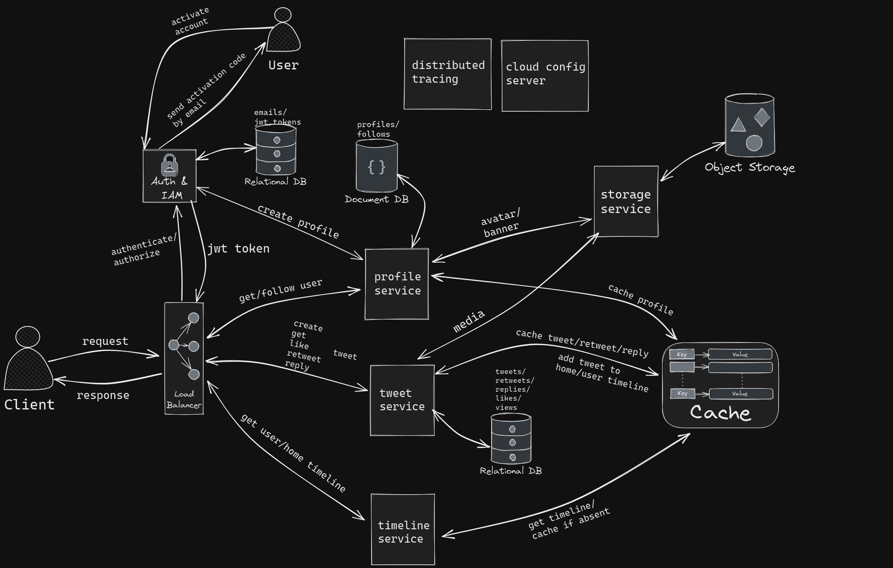

# twitter-clone-backend

## Content
* [Overview](#overview)
* [System design](#application-system-design)
* [Technology stack](#technology-stack)
* [Additional tools](#additional-tools)
* [Main services](#main-services)
* [Auxiliary services](#auxiliary-services)
* [Tests coverage](#tests-coverage)
* [Local deployment](#how-to-run-application-locally)

## Overview
This is a clone of the popular social network Twitter. It is a reliable, scalable and fast application with microservice architecture inside. There are 8+ microservices communicating with each other.

## Application system design


## Technology stack
- Java 17

- Spring Boot 3.0.5
- Spring Cloud 2022.0.2
- Spring Web
- Spring Security
- Spring Data Jpa

- Redis
- MongoDB
- PostgreSQL

## Additional tools
- OpenFeign
- Discovery Server
- Spring Api Gateway
- Distributed tracing with Zipkin
- Spring cloud config server
- Mapstruct
- Swagger docs
- AWS blob storage
- Testcontainers
- Mockito

## Main Services
* [Authentication service](#authentication-service)
* [Storage service](#storage-service)
* [Profile service](#profile-service)
* [Tweet service](#tweet-service)
* [Timeline service](#timeline-service)

### Authentication service
This service is responsible for registration and authorization. When user registering, he provides email, username and password, then service send activation code by email, and when account is activated, user can log in with email and password and receive his personal jwt token that will expire in 24 hours.

### Storage service
Service is establishing connection with Amazon blob storage, in which other services can store some media and receive url for that as a response.

### Profile service
With this service, user can see and follow other users, as well he can be followed by others, also user can update his profile and upload custom avatar and banner. There is cache system, that will store popular profiles of users in cache.

### Tweet service
Current service provides ability to create/update/delete tweets, retweet/like/reply on them. Also, there is views system, so when user get any tweet, views counter is incremented by 1, and cache system that will cache popular tweets. When user creates new tweet, it will be added to user's user timeline and home timelines of his followers in cache, but if user has a lot of followers, it will be added only to user timeline.

### Timeline service
This service is responsible for providing any type of timeline for user. When user gets his user timeline, then it will be received from cache, but if it's absent there, it will be requested from tweet service which will obtain it from database and give it back sorted by chronological order. When user gets his home timeline, service tries to obtain it from cache, but if there was nothing, then it will take user timeline of every followee of that user, sort resulted list and cache it for further usage. As is known celebrities don't push created tweets to home timelines of followers, so that service take user timeline of every followee celebrity and add those tweets to the response as well as sort it by chronological order.

## Auxiliary services
* [Api Gateway](#api-gateway)
* [Discovery server](#discovery-server-and-loadbalancer)
* [Cloud config server](#cloud-config-server)

### Api Gateway
Api gateway provides centralized access to main application. This service receives jwt token for user from authentication service and provides security for the entire application, so that without jwt token service doesn't allow user interact with services.

### Discovery server and LoadBalancer
Eureka discovery server allow other microservices interact with each other without knowledge of exact ip and port of needed service, also it has inner loadbalancer, so that each request will be delivered to the right service.  

### Cloud config server
Config server provides configuration properties for all services in the application.

## Tests coverage


## How to run application locally
1. Install docker desktop and configure it.
2. Download docker-compose.yml folder
3. Open downloaded folder in terminal and enter ```docker-compose up```
4. Wait until all images are pulled and containers are created
5. Open postman and send requests!
> If you need documentation for endpoints, hit http://localhost:8080/swagger-ui.html

> You have to create tweet or update profile this way:
