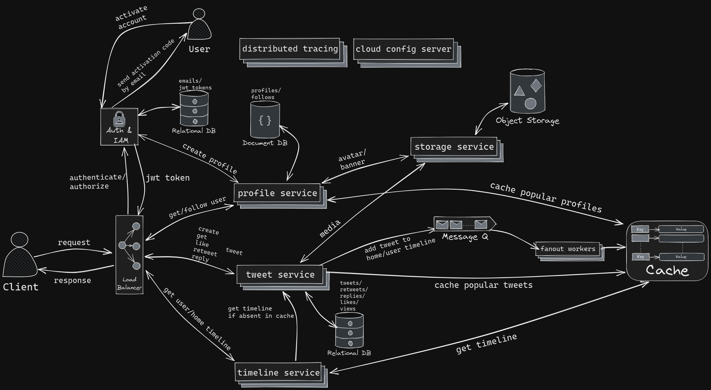
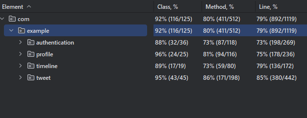
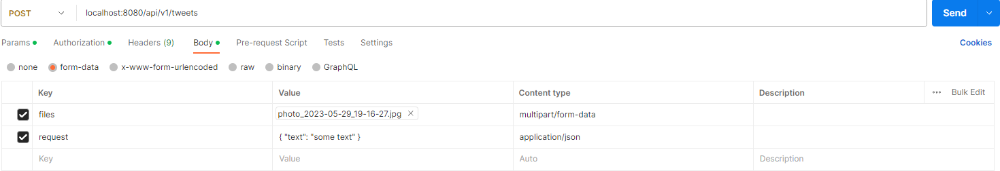

# Twitter

> Twitter is a social media application that allows users to connect and share their thoughts and experiences with
> others. With a robust system design and a reliable technology stack, Twitter provides a seamless and secure user
> experience.

## Content

* [Overview](#overview)
* [Architecture Diagram](#architecture-diagram)
* [Technology stack](#technology-stack)
* [Additional tools](#additional-tools)
* [Tests coverage](#tests-coverage)
* [Local deployment](#how-to-run-application-locally)

## Overview

> This application is built using a microservices architecture with the Spring framework, allowing for modular and
> independent development of specific functionalities. This approach enables scalability and maintainability of the
> application.

## Architecture Diagram



## Technology stack

- Java 17

- Spring Boot 3.0.5
- Spring Web
- Spring Security
- Spring Data Jpa
- Spring Cloud

- Redis
- MongoDB
- PostgreSQL

## Additional tools

- Apache Kafka
- AWS blob storage
- OpenFeign
- Discovery Server
- Spring Api Gateway
- Distributed tracing with Zipkin
- Spring cloud config server
- Mapstruct
- Swagger docs
- Testcontainers
- Mockito

## Main Services

* [Authentication service](#authentication-service)
* [Storage service](#storage-service)
* [Profile service](#profile-service)
* [Tweet service](#tweet-service)
* [Timeline service](#timeline-service)

### Authentication service

Handles user registration, authorization, and generation of JWT tokens for secure login that expires after 24 hours.
Once the user activates their account by entering the code, they can log in using their email and password and receive a
personal JWT token that expires after 24 hours.

### Storage service

Connects to Amazon blob storage, enabling users to store and retrieve media files.

### Profile service

Allows users to view and follow other users, update their profiles, and upload custom avatars and banners. The service
utilizes caching to store popular user profiles for improved performance.

### Tweet service

Allows users to create/update/delete tweets, as well as retweet/like/reply on them. Also, there is views
system, so when user gets any tweet, views counter is incremented by 1, and cache system that will cache popular tweets.
When user creates new tweet, it will be added to user's user timeline and home timelines of his followers in cache, 
however if user has a lot of followers, it will be added only to user timeline to reduce time and improve performance.

### Timeline service

Provides any type of timeline for user. When user gets his user timeline, then it will
be received from cache, but if it's absent there, it will be requested from tweet service which will obtain it from
database and give it back sorted by reversed chronological order. When user gets his home timeline, service tries to 
obtain it from cache, but if there was nothing, then it will take user timeline of every followee of that user, sort 
resulted list and cache it for further usage. As is known celebrities don't push created tweets to home timelines of followers,
so that service take user timeline of every followee celebrity and add those tweets to the response as well as sort it by
reversed chronological order.

## Auxiliary services

* [Fanout Service](fanout-service)
* [Api Gateway](#api-gateway)
* [Discovery server](#discovery-server-and-loadbalancer)
* [Cloud config server](#cloud-config-server)

### Fanout service
This service receives messages with entities from the message queue and store them in cache for particular user.

### Api Gateway

Acts as a centralized access point for the application, ensuring secure interaction with the services using JWT tokens.

### Discovery server and LoadBalancer

Facilitates microservice communication by enabling service discovery and load balancing.

### Cloud config server

Provides configuration properties for all services in the application.

## Tests coverage



## How to run application locally

1. Install docker desktop and configure it.
2. Download docker-compose.yml
3. Open file location in terminal and enter ```docker-compose up```
4. Wait until all images are pulled and containers are created
5. Open postman and send requests!

> If you need documentation for endpoints, hit http://localhost:8080/swagger-ui.html

> You have to create tweet or update profile this way:

